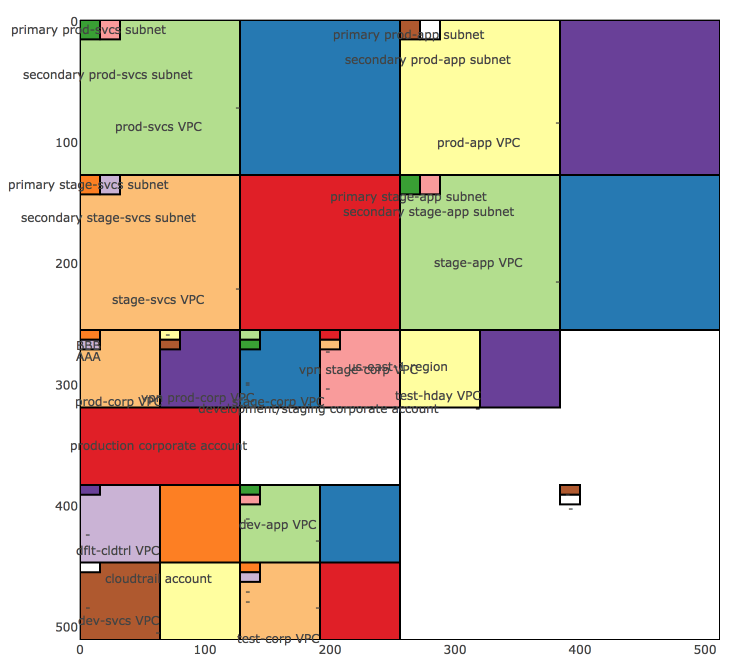

# CIDR Visualiser

##### WIP Depop hackday project from March 2017.

Accepts a CSV of CIDR ranges with annotations as shown in `network.csv`.

Shows a graphical representation of address space.

Can be used to identify overlaps & unused space.

##### Example output:

